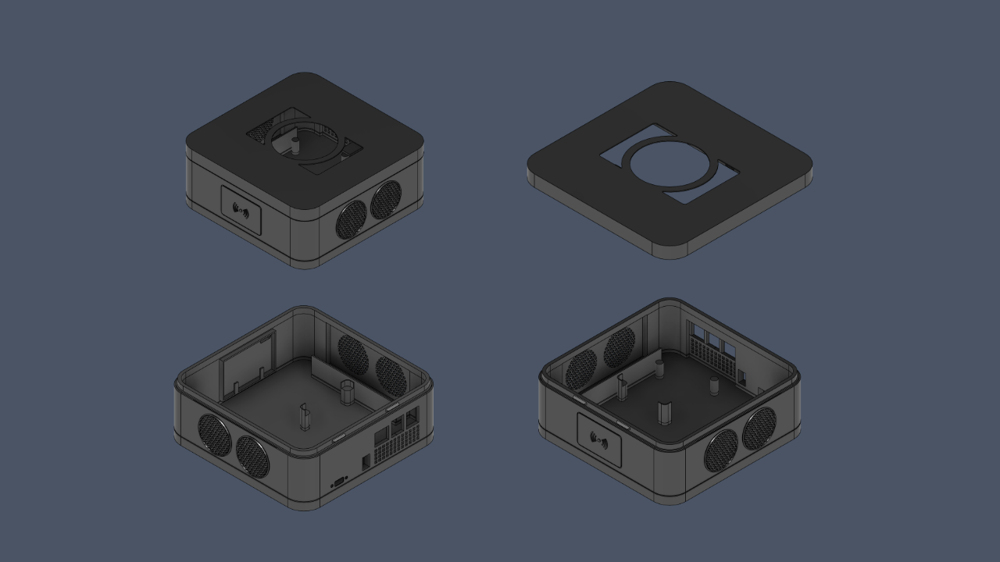
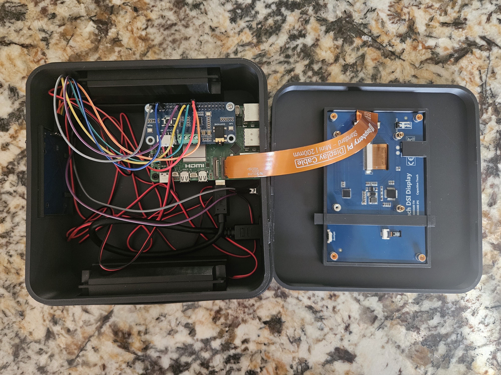

<p align="center"></p>

# PiDeck - RFID Record Player

This project is a new modern take on the classic record player. Instead of vinyl records, users can create their own custom records that instantly play their favorite albums, playlists, or songs right off your Spotify.

The PiDeck uses RFID technology to detect a record when placed on the reader. The same technology you would use to tap your credit card to checkout at the store or access a restricted building.

## Features
- RFID-powered music selection
- Spotify integration
- Custom 3D printed enclosure
- Portable battery-powered operation
- Built-in touchscreen interface
- Album artwork display
- Play/pause and track controls
- Safe shutdown power switch

## 3D Design & Manufacturing

<p align="center"></p>

The PiDeck enclosure was designed from scratch in Fusion 360 and 3D printed.

The design was carefully engineered to:

- Fit all electronics within a compact portable enclosure
- Provide access to charging and USB ports
- Maximize internal space efficiency
- Include ventilation openings for airflow and cooling
- Create a clean, modern appearance

## Software

The PiDeck software was written entirely in Python and runs on a Raspberry Pi 5.

The system consists of two primary components:

###RFID Record Writer

Associates Spotify albums, playlists, or songs with an RFID tag.

### RFID Record Player

Reads RFID tags and automatically starts playback through Spotify when a matching record is detected.

Additional software features include:

- Spotify device management
- Album artwork retrieval
- Touchscreen user interface
- Playback controls
- Safe shutdown handling

## Hardware Overview

<p align="center"></p>

### Components

| Component | Purpose |
|------------|------------|
| Raspberry Pi 5 | Main computer running the software |
| X1200 UPS HAT | Battery management and charging |
| WM8960 Audio HAT | Audio amplification and output |
| 2× 8Ω 5W Speakers | Audio playback |
| 5" IPS DSI Touchscreen | Album artwork and user controls |
| MFRC522 RFID Reader | Reads RFID records |
| RFID Cards | Trigger playlists and albums |
| Rocker Switch | Safe shutdown and power control |

## System Architecture

```mermaid
flowchart TD

    A[RFID Record] --> B[MFRC522 RFID Reader]
    B --> C[Python Application]

    C --> D[Spotify API]
    D --> E[Raspotify Device]
    E --> F[WM8960 Audio HAT]
    F --> G[Speakers]

    C --> H[Touchscreen UI]
    H --> I[Album Art]
    H --> J[Playback Controls]

    K[X1200 UPS HAT] --> L[Battery Pack]
    K --> M[Raspberry Pi 5]
